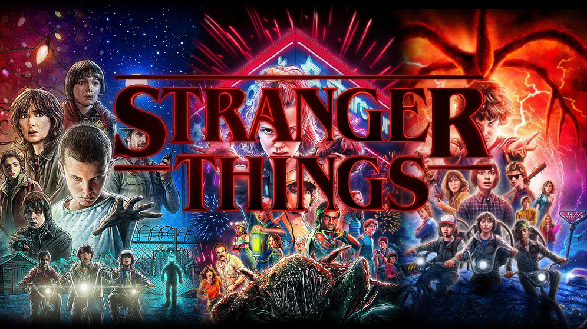

<h1>Memoria del proyecto fin de evaluación de Lenguajes de Marcas - 1º DAM/DAW</h1>
<h2>Black Mirror - A tribute site</h2>
<h2>Indice</h2>
<ul>
  <li><a href="#introduccion">Introducción</a></li>
  <li><a href="#motivacion">Motivación</a></li>
  <li><a href="#estructura">Estructura</a></li>
  <li><a href="#estilo">Estilo</a></li>
</ul>

<h2 id="introduccion">Introducción</h2>

Trabajo realizado en clase por: Juan Cid Benítez

Proyecto de web "from scratch" de 1ª evaluación de Lenguajes de Marcas

Diciembre de 2023 

Licencia CC-BY

<h2 id="motivacion">Motivación</h2>

El tema lo he elegido porque es una serie que me fascina, y además me parece un buen contenido para hacer mi primera web

<h2 id="estructura">Estructura</h2>

La web está dividida en  6 secciones:

<ul>
  <li>Hero Section</li>  
  <li>Introducción</li>
  <li>Personajes</li>
  <li>Temporadas </li>
  <li>Produccion</li>
  <li>Footer</li>
  </ul>
  
Sin embargo tengo 4 subpáginas que están divididas cada una en 2 secciones:

  <ul>
  <li>Sinopsis</li>
  <li>Personajes</li> 
  </ul>

<h3>Hero Section</h3>

He utilizado una imagen de fondo tomada de pinterest que se adapta fácilmente a diferentes dispositivos como PC, tablets , móviles... 
Sobre ella no he colocado un Call to Action debido a que no lo encontraba portuno en mi página web y no me gustaba como quedaba 

<h3>Introducción</h3>

He dispuesto en un grid de 2 columnas....

.......

y aqui pongo <b>lo que quiera</b>

<h3>Footer</h3>

breve explicación 

<h2 id="estilo">Estilo de la página</h2>
<h3>Paleta de colores</h3>

.....

<h3>Tipografías</h3>

.....

<h3>Imágenes</h3>

.....

<h3>Videos</h3>

.....

...................
<h2 id="snippets">Code snippets</h2>

He utilizado los siguientes:

<ul>
  <li>Barra de navegación: tomada de w3Schools "How to" (poner vínculo)</li>
  <li>Accordion: ..............</li>
  <li>..........</li>
</ul>